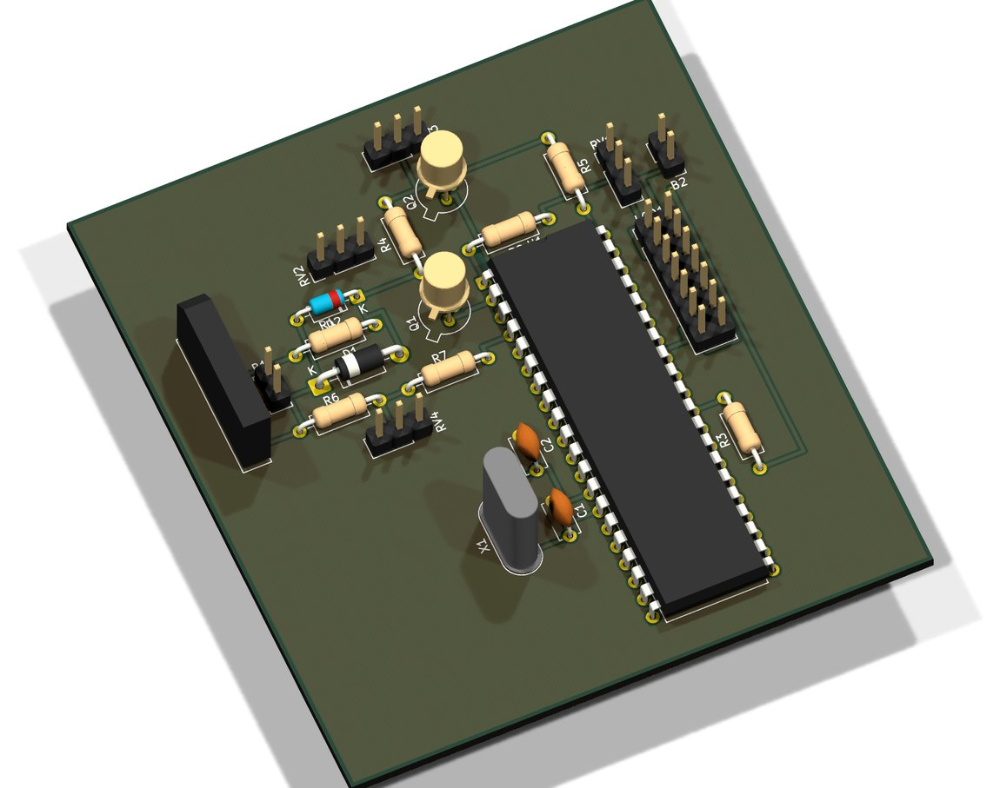

# Microcontroller & Sensor Firmware Studies
> A set of small but complete embedded programs — PIC instrumentation with LCD readout, and an NFC tag reader.
`2025` · `PIC` · `mikroC` · `Arduino` · `PN532 NFC` · `HD44780 LCD` · `ADC` · `I2C`



## About

A collection of the smaller embedded programs that make up the everyday practice behind the larger builds — each one complete, compiled and doing a real job on real silicon.

**PIC instrumentation (mikroC).** A digital tachometer that reads three analog channels through the ADC and drives a 16×2 HD44780 LCD in 4-bit mode; and a motor-speed program that computes RPM and voltage and switches a transistor output while displaying the reading. Both carry their full toolchain output — compiled hex, listing and assembly.

**NFC reader.** An Arduino program driving a PN532 module over I2C to read passive MIFARE / ISO 14443A tag UIDs and report them over serial — the access-control front end from an internship task.

None of these is a headline project, but together they are the reason the headline projects work: the LCD, ADC, I2C and serial groundwork that a bigger robot quietly depends on.

## Contents

```
captures/
docs/
kicad/
```

## Notes

## Third-party work used here

Everything in this repository is my own work. It builds on the following, which are **not** mine and are used under their own licences:

- **KiCad** by KiCad project — <https://kicad.org>
- **Proteus Design Suite** by Labcenter Electronics — <https://labcenter.com>

## Author

Lassaad Mahmoudi — <contact@iris-systems.tn>  
https://linkedin.com/in/mahmoudiassaad
